### Writeup for Paper (machine created by secnigma) 

Starting  the machine & doing a quick nmap scan reveals the machine hosts a webserver and ssh. Checking the webserver we are greeted with a default apache 2 page. Which tells us the machine is running centOS 8. It also is running a version of apache possibly vulnerable to priv esc but looking at the bug it requires us to wait till 6:45 am so  no way. The other thing is because it tells us the operating system it means it was downloaded using a package manager which means though it may say version 2.4.37 the version installed may not be vulnerable as security paches are added to the packages of versions that normally would be vulnerable.

In my experience a default page usually means we need to figure out the virtual host name. Looking at the cert of the https server gives us localhost.localdomain. However, that doesn't change anything, so next I run a nikto scan which reports an unusual header.
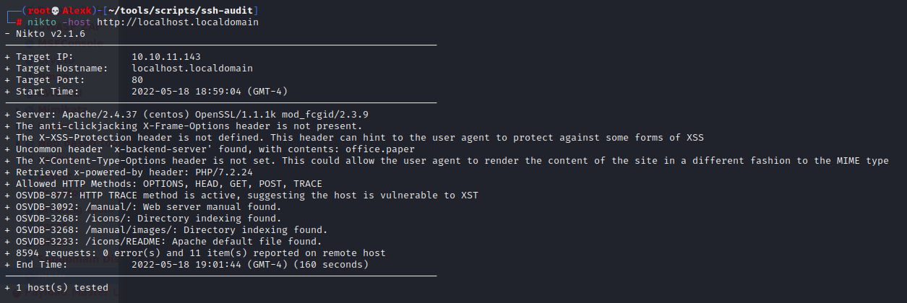

Editing our /etc/hosts to have office.paper resolve to the machine reveals a wordpress blog.
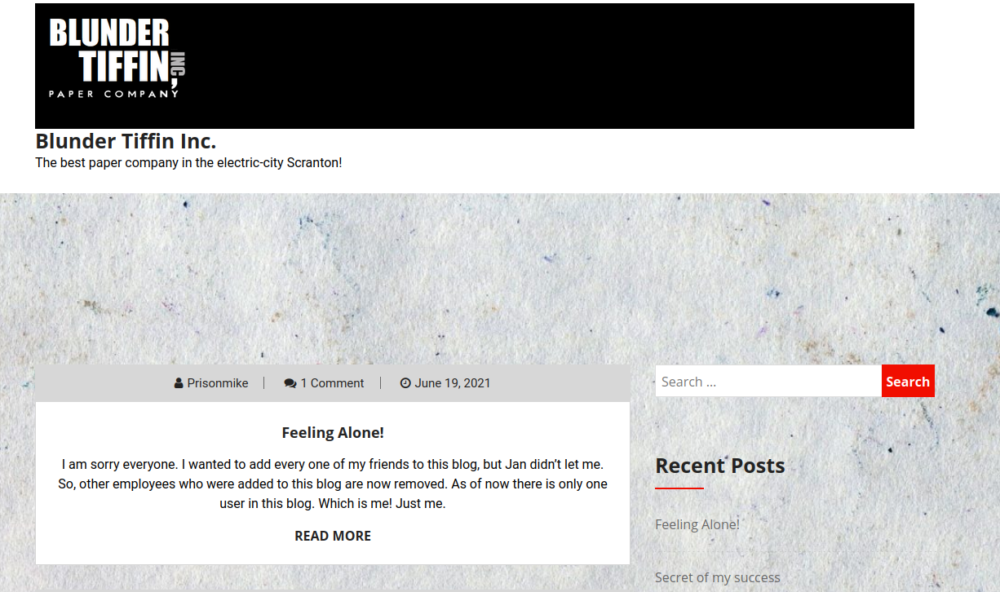

Looking at most recent post we see Nick has told us theire is sensitive information in the drafts. Lets check exploit-db for this version of wordpress before our wpscan because I have vague memory of another challenge like this.

We find this version is vulnerable to a information disclosure exploit.
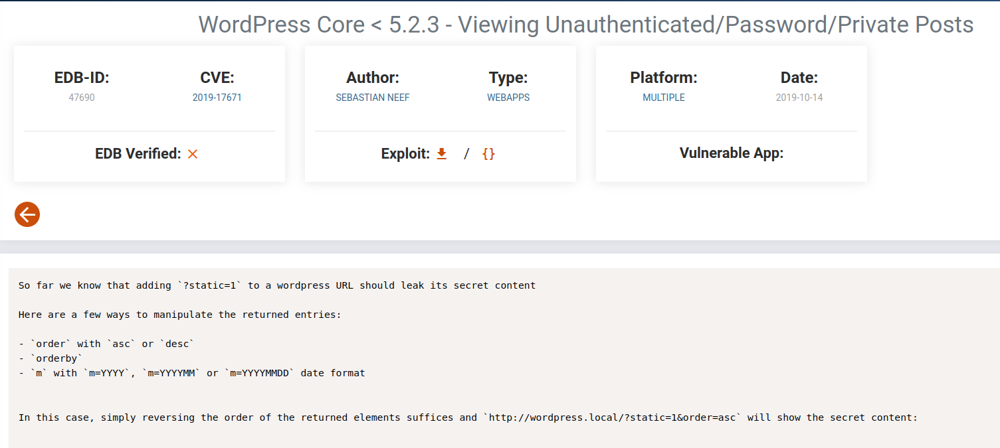

Exploiting the blog post by setting the static parameter to 1  we see the following.
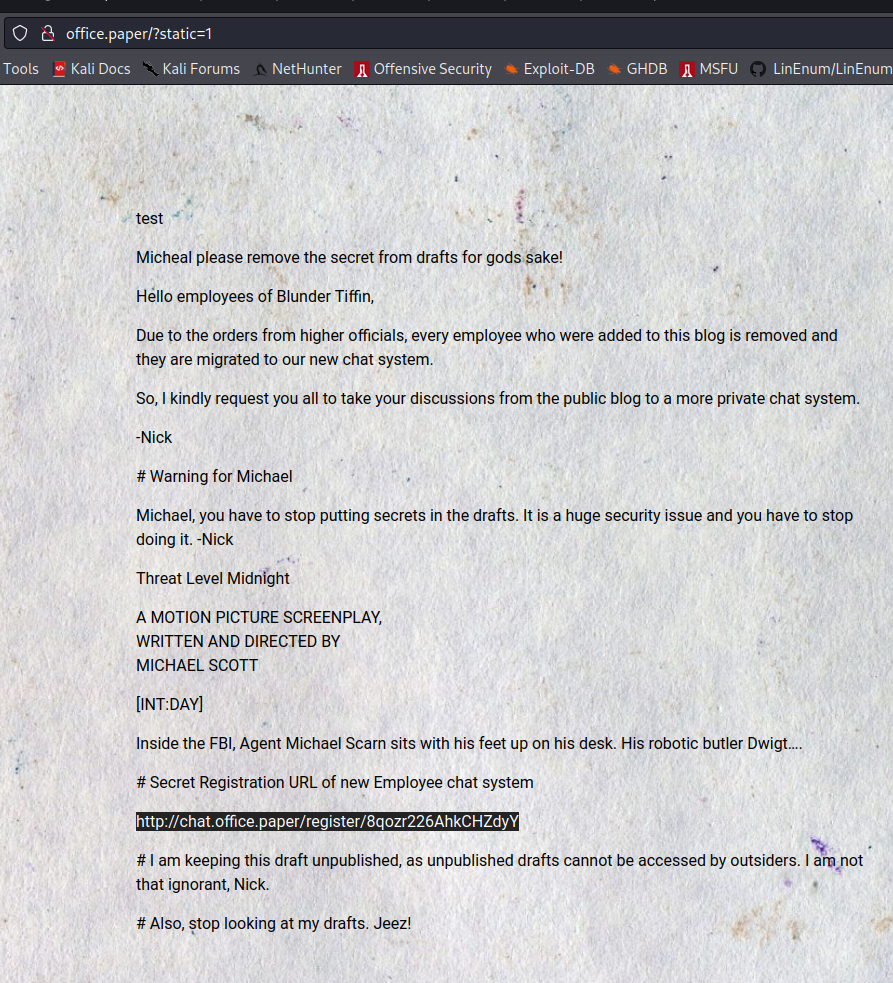

Following the link we see a registration page for rocketchat.
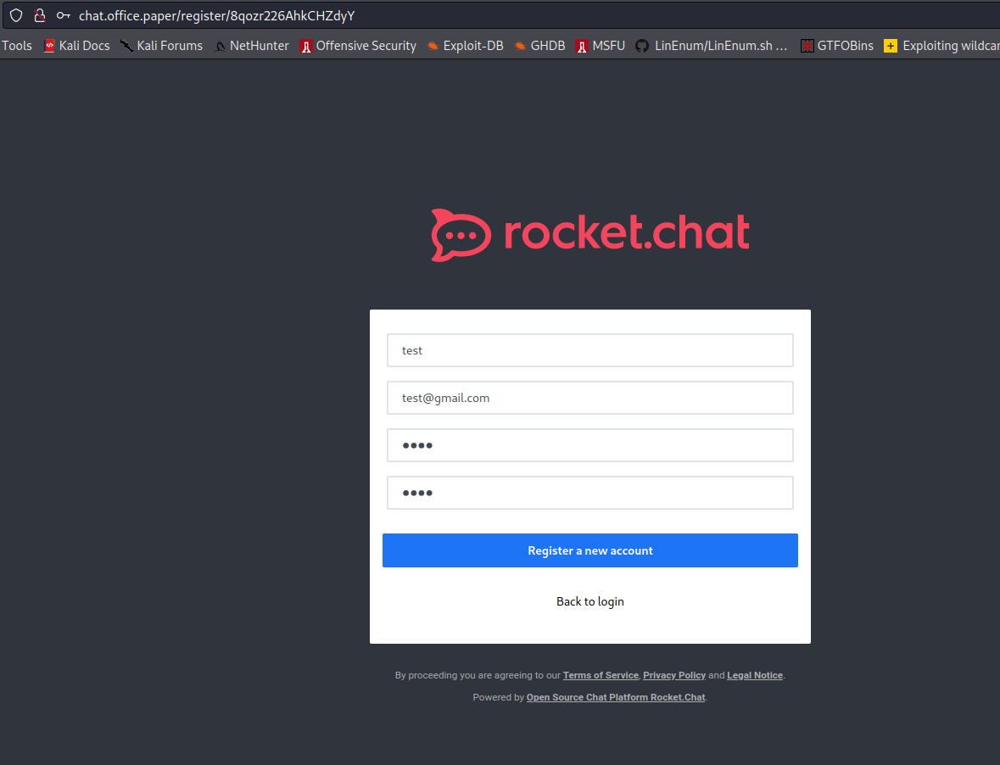

Creating an account & loggin in, we see a group chat that has a bot in it called recyclops. It see we have limited access to run commands through the bot.
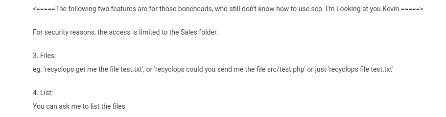

Reading files we can infer the the bot runs cat INPUT and ls -al INPUT with the list command. Lets try injecting os commands.
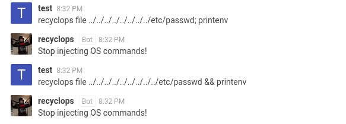

Unfortunately its not that easy. Digging around we find the files for the rocket chat bot. We find an interesting directory called scripts. Like list.js. One interesting one is run.js. Reading the file it seems like the bot has an undocumented (at least in the rocketchat gc) command to  run arbitrary commands. Lets try it.
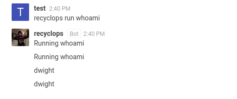

Lets pop a shell with the classic one line bash tcp rev shell.
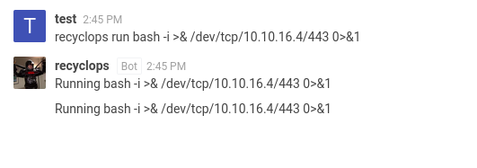

Nice now lets get user flag.
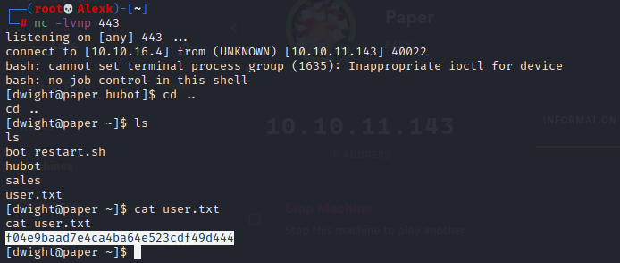

Checking our enviornment we see an interesting variable, ROCKETCHAT_PASSWORD 
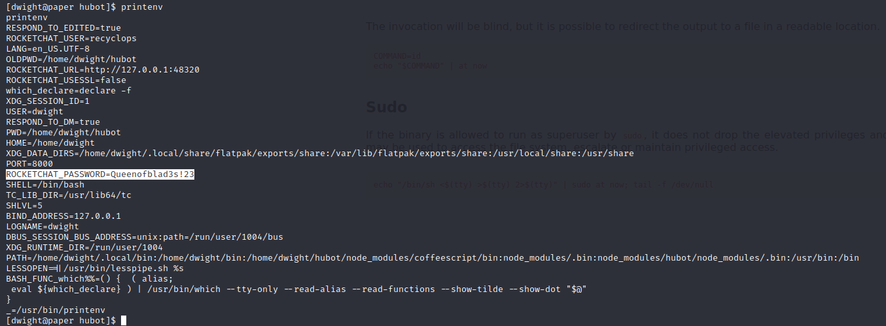

Lets see if dwight reuesed his password on the ssh server so we don't need to bother with setting up socat.
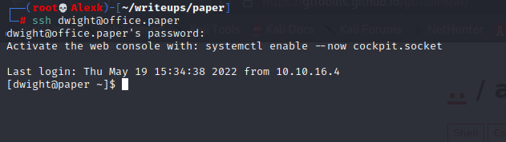

Copying linpeas.sh onto the machine & running shows nothing very promising. I go through the rest of my checklist. One of the cve recomenders recomends CVE-2021-3560. Looking into it we find its a race condition vulnerability in polkit.  
