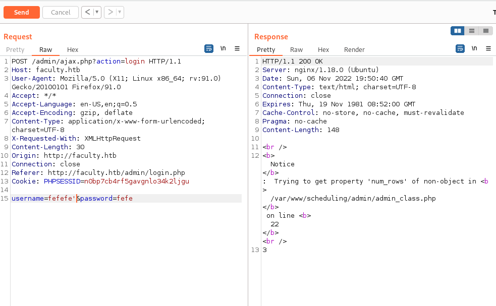

### Faculty writeup (Created by gbyolo)

An nmap scan reveals ssh and http open. The http redirects to facutly.htb. We add an entry for it into our /etc/hosts and we see a page where we are asked to enter a faculty id number. We have no idea what the format for faculty ids are so I ran a feroxbuster before trying anything on the faculty login page. We find an endpoint that redirects to a admin login page.


The login page is vulnerable to sqli in the username field but finding it requires paying attention to teh raw responses of the server.


Testing for sqli using a single quote shows us the same error as if we enter wrong credentials.


However inspecting the traffic reveals it is likely sqli is possible.


We can test if both parameters are injectable by seeing if we get an error if we inject each parameter seperately. 


We can see password is not injectable most likely the password input is being hashed before being passed to the sql query. 



THe admin parameter is clearly injectable however. Testing a simple login bypass sqli with the username admin works. If admin did not exist though we could change the format of our injection using an or statment and a boolean statment that is always true. 


After we login we are redirected to an administrator panel for a school's scheduling. There are a number of different endpoints with different functionality. The most interesting being the faculty list and subject list endpoints which let us download pdfs.


Interectepting the request it appears we are able to control the pdf generated. As we send a request with a pdf postform field that contains double url encoded and base64 encoded pdf data.


After sending this request we are redirected to the generated pdf that exists in the mpdf directory. Mpdf is php library that is used to generate dynamic pdfs. Doing some research mpdf has a cve that allows for arbitrary file read in versions less then 7.0.0. I wasn't able to find any good ways to figure out the version of mpdf running so I figured I may as well try the exploit. 


The exploit allows for file read by adding a annotation file to the pdf with a local file on the system. We can test by trying to use the exploit to read /etc/passwd off the server.


Clearly the server is vulnerable. However as we will be probably need to read a lot of files and it is quite annoying to exploit this vulnerablilty manually like this lets quickly make a bash script to automate the process of reading the file.

```
#!/bin/bash

#file to read is $1

raw="<annotation file=\"$1\" content=\"$1\" icon=\"Graph\" title=\"Attached File: $1\" pos-x=\"195\" />"

encode=$(urlencode $raw | base64 | tr -d " \t\n\r")

filename=$(curl http://faculty.htb/admin/download.php -X POST -b "PHPSESSID=qcs9hac7urer83l9364bsvl8hm" -d "pdf=$encode" 2>/dev/null | tr -d " \t\n\r")

$(wget -q http://faculty.htb/mpdf/tmp/$filename -O /tmp/$filename 2>/dev/null)

if test -f "/tmp/$filename"; then
        file=$(./pdf-parser.py -f /tmp/$filename -o 6 | tail -n 2 | head -n 1)
        if [[ -z $file ]]; then
                file="b''"
        fi
        python3 -c "print($file.decode('utf-8'));"
        rm /tmp/$filename
else
        echo "File doesn't exist or caused an error"
fi 
```
This script takes the file to read as a command line argument then sends a request to the server to generate the pdf. It then downloads the file and uses a pdf-parser python script made by  to extract the attached file printing it's contents. This link to the script is . If the file cannot be read or does not exist it will instead print "File doesn't exist or caused an error". 


Reading the /etc/passwd file reveals two insteresting users: developer and gbyolo. Reading their ssh private keys unfrotunately is not possible.


Lets leak the source code for the webpage and start looking for another vulnerbaility so we can try to get rce on the machine. Most php websites have  adb_conn.php file that contains a password so we should also check for password reuse on the two users we found.


Checking the credentials on the users reveals that gbyolo has the same password as the db account letting us get commandline access to the box.


## User

As we cannot read the user flag as gbyolo so we need to look for priv esc. We have a password so lets see if we have an sudo permissons. 


We are able to sudo as the developer user and run meta-git, which is a node library that allows for anagement of meta repositories using git commands. Luckily looking for cve's on the library reveals a command injection vulnerability reported on hackerone by .


Looking at his report the file that the vulnerability exists in is metaGitUpdate.js. Lets read the metaGitUpdate.js file on the box and see if it has the same vulnerble code.


This snippet is clearly vulnerbale to command inject there being no sanitization of user inputs. Lets see if we can get the developer user's ssh private key using this technique.


Success!
With this we can reconnect through ssh as the developer user and get the first flag!


